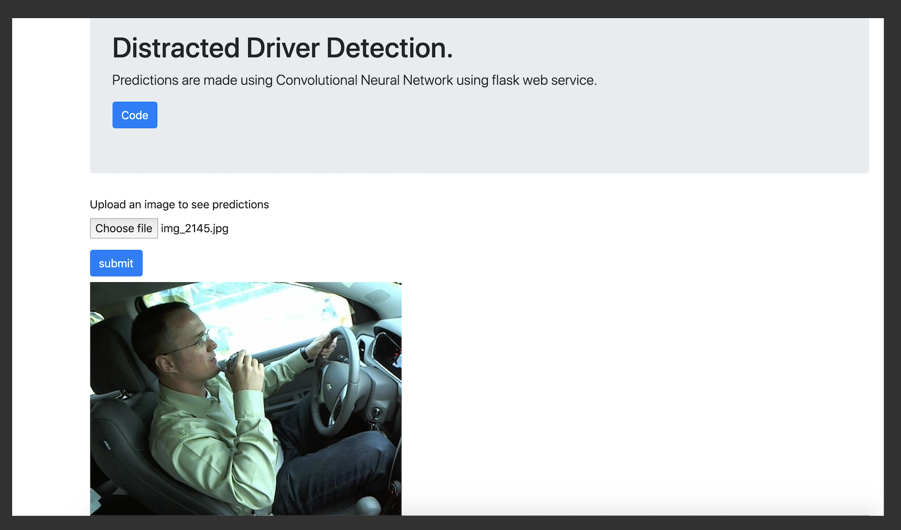

This is a image classifier to predict driver distraction while driving. 
For more information on Dataset visit <a href="https://www.kaggle.com/c/state-farm-distracted-driver-detection" target="_blank">here</a>

1. `virtualenv env`
2. `source ./env/bin/activate`
3. `pip install -r requirement.txt`
4. `FLASK_APP=app.py flask run` or `FLASK_APP=model.py flask run`

Note - uploaded images should be from same distribution as training images, other images might get predicted wrong prediction.

