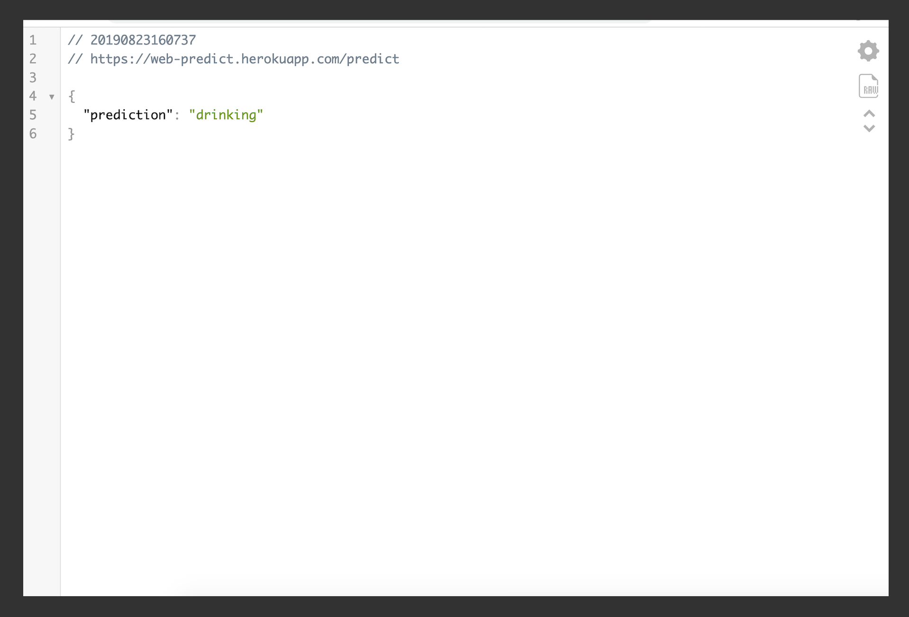

This is a image classifier to predict driver distraction while driving.

For more information visit <a href="https://www.kaggle.com/c/state-farm-distracted-driver-detection" target="_blank">here</a>

1. `virtualenv env`
2. `source ./env/bin/activate`
3. `pip install -r requirement.txt`
4. `FLASK_APP=predict.py flask run` or `FLASK_APP=predict_vgg.py flask run`

Note - uploaded images should be from same distribution as training images, other images might get predicted wrong prediction.

If predict_vgg.py is used download .h5 file from <a href="https://drive.google.com/open?id=1XmSaxai2ePaLq6shpSiU3vjlwBYi8fmq" target="_blank">here</a> and put it in current directory

# Distracted-Driver
